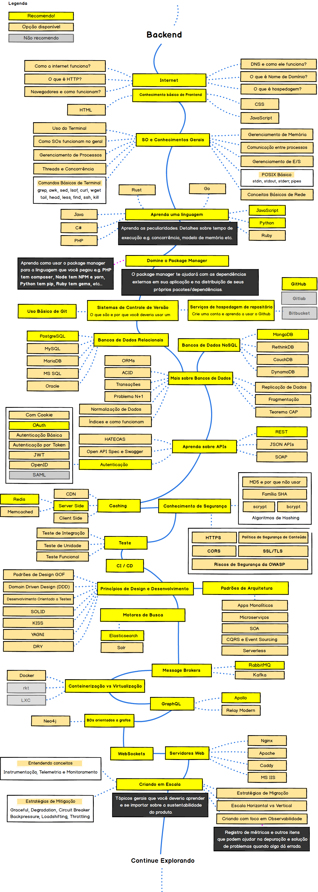

  
  <h1 align="center">Guia do Desenvolvedor Back-end</h1>

## :dart: O guia para alavancar a sua carreira

Abaixo você encontrará conteúdos para te guiar e ajudar a se torna um desenvolvedor back-end, caso você já atue como back-end confere o repositórios para descobrir novas ferramentas para o seu dia-a-dia, os caminhos que você pode tomar e as tecnologias para incorporar na sua stack para se tornar um profissional atualizado e diferenciado no back-end, faça bom uso do guia e bons estudos!

 <strong>Segue nas redes sociais para acompanhar mais conteúdo: </strong>  

## ⚠️ Aviso importante

> Antes de tudo você pode me ajudar e colaborar, deu bastante trabalho fazer esse repositório e organizar para fazer seu estudo ou trabalho melhor, portanto você pode me ajudar das seguinte maneiras

- Me siga no [Github](https://github.com/arthurspk)
- Acesse as redes sociais do [Guia Dev Brasil](https://linktr.ee/guiadevbrasil)
- Mande feedbacks no [LinkedIn](https://www.linkedin.com/in/arthurspk/)
- Faça uma doação pelo PIX: arthurcoutinho2@hotmail.com

## 💡 Nossa proposta

> A proposta deste guia é fornecer conteúdos para estudo e ferramentas para guiá-lo se você estiver confuso sobre qual o próximo aprendizado, não influenciar você a seguir os 'hypes' e 'trendys' do momento. Acreditamos que com um <b>maior conhecimento das diferentes estruturas e soluções disponíveis poderá escolher a ferramenta que melhor se aplica às suas demandas.</b> E lembre-se, 'hypes' e 'trendys' nem sempre são as melhores opções.

## :beginner: Para quem está começando agora

> Não se assuste com a quantidade de conteúdo apresentados neste guia. Acredito que quem está começando pode usá-lo não como um objetivo, mas como um apoio para os estudos. <b>Neste momento, dê enfoque no que te dá produtividade e o restante marque como <i>Ver depois</i></b>. Ao passo que seu conhecimento se torna mais amplo, a tendência é este guia fazer mais sentido e fácil de ser assimilado. Bons estudos e entre em contato sempre que quiser! :punch:

## 🚨 Colabore

- Abra Pull Requests com atualizações
- Discuta ideias em Issues
- Compartilhe o repositório com a sua comunidade

## :small_blue_diamond: Back-end roadmap

## ◾ Linux

> Linux é um termo popularmente empregado para se referir a sistemas operativos ou sistemas operacionais que utilizam o Kernel Linux. O núcleo foi desenvolvido pelo programador finlandês Linus Torvalds.

- [Melhores distros linux para programadores](https://github.com/arthurspk/guiadevbrasil#-melhores-distros-linux-para-programadores) - Segue a lista das melhores distros de Linux para programadores, diretamente do arquivo geral do Guia Dev Brasil.
- [Guia Foca](https://guiafoca.org/) - O GuiaFoca é um guia que traz desde explicações básicas sobre computadores e o sistema GNU/Linux até a administração e segurança do sistema. Os assuntos do guia são explicados em linguagem clara e organizados de forma linear e didática, evitando termos técnicos nos níveis iniciais, até que o usuário se habitue com sua utilização de forma gradual.
- [Informações sobre distros](https://distrowatch.com/) - Informações e atualizações sobre distros.
- [Cursos de Linux](https://pastebin.com/L3sy0k1H) - Cursos de Linux para te guiar do básico ao avançado.

## ◾ Git & Github

> Git é um sistema de controle de versões distribuído, usado principalmente no desenvolvimento de software, mas pode ser usado para registrar o histórico de edições de qualquer tipo de arquivo.

- [Git - W3Schools](https://www.w3schools.com/git/default.asp) - W3Schools é um site educacional voltado ao aprendizado de tecnologias web. Seu conteúdo inclui tutoriais e referências relacionadas a diversas linguagens.
- [Git4Noobs](https://github.com/DanielHe4rt/git4noobs) - A ideia é ensinar para os usuários iniciantes que o Git não é nenhum "monstro" de se aprender e também ensinar como usar num ambiente onde há mais de um desenvolvedor atuando no projeto sem desorganizar ou perder algum traço de código no processo.
- [Conhecendo os super poderes do Git](https://github.com/theandersonn/comandos-git) - Guia com seleção de comandos para o Trabalho com Git e GitHub
- [Aprenda Git](https://learngitbranching.js.org/?locale=pt_BR) - Aprenda a utilizar o Git e seus comandos através desse site.
- [Git School](https://git-school.github.io/visualizing-git/) - Escola do Git, várias ferramentas para treinar e aprender Git.
- [Git Flow Cheatsheet](https://danielkummer.github.io/git-flow-cheatsheet/) - Este cheatsheet demonstra o uso básico e o efeito das operações do git-flow
- [Cursos de Git & Github](https://github.com/arthurspk/guiadevbrasil#-cursos-de-git-e-github) - Cursos de Git & Github do repositório geral do Guia Dev Brasil

## ◾ HTTP

> O Hypertext Transfer Protocol, sigla HTTP é um protocolo de comunicação utilizado para sistemas de informação de hipermídia, distribuídos e colaborativos. Ele é a base para a comunicação de dados da World Wide Web.

- [MDN - HTTP](https://developer.mozilla.org/pt-BR/docs/Web/HTTP) - O MDN Web Docs é o website oficial de Mozilla para desenvolvimento de padrões web

## ◾ APIs

> O conceito de API nada mais é do que uma forma de comunicação entre sistemas. Elas permitem a integração entre dois sistemas, em que um deles fornece informações e serviços que podem ser utilizados pelo outro, sem a necessidade de o sistema que consome a API conhecer detalhes de implementação do software, as APIs permitem que o usuário final utilize um aplicativo, software ou até uma simples planilha, consultando, alterando e armazenando dados de diversos sistemas, sem que o usuário precise acessá-los diretamente.

- [MDN - APIs](https://developer.mozilla.org/pt-BR/docs/Web/API) - O MDN Web Docs é o website oficial de Mozilla para desenvolvimento de padrões web
- [APIs Públicas](https://github.com/public-apis/public-apis) - Uma lista coletiva de APIs gratuitas para uso em software e desenvolvimento web

## ◾ HTML

> HTML (Linguagem de Marcação de HiperTexto) é o bloco de construção mais básico da web. Define o significado e a estrutura do conteúdo da web. Outras tecnologias além do HTML geralmente são usadas para descrever a aparência/apresentação (CSS) ou a funcionalidade/comportamento (JavaScript) de uma página da web, sendo assim HTML é uma linguagem essência para você que quer se tornar desenvolvedor front-end.

- [MDN - HTML](https://developer.mozilla.org/pt-BR/docs/Web/HTML) - O MDN Web Docs é o website oficial de Mozilla para desenvolvimento de padrões web
- [Cursos de HTML](https://github.com/arthurspk/guiadevbrasil#-cursos-de-html-e-css) - Cursos de HTML do repositório geral do Guia Dev Brasil

## ◾ CSS

> CSS (Cascading Style Sheets) é um mecanismo para adicionar estilo a um documento web. O código CSS pode ser aplicado diretamente nas tags ou ficar contido dentro das tags <style>. Também é possível, em vez de colocar a formatação dentro do documento, criar um link para um arquivo CSS que contém os estilos.

- [MDN - CSS](https://developer.mozilla.org/pt-BR/docs/Web/CSS) - O MDN Web Docs é o website oficial de Mozilla para desenvolvimento de padrões web
- [Cursos de CSS](https://github.com/arthurspk/guiadevbrasil#-cursos-de-html-e-css) - Cursos de CSS do repositório geral do Guia Dev Brasil

## ◾ JavaScript

> JavaScript é uma linguagem de programação interpretada estruturada, de script em alto nível com tipagem dinâmica fraca e multiparadigma. Juntamente com HTML e CSS, o JavaScript é uma das três principais tecnologias da World Wide Web.

- [MDN - JavaScript](https://developer.mozilla.org/pt-BR/docs/Web/CSS) - O MDN Web Docs é o website oficial de Mozilla para desenvolvimento de padrões web
- [Cursos de JavaScript](https://github.com/arthurspk/guiadevbrasil#-cursos-de-javascript) - Cursos de JavaScript do repositório geral do Guia Dev Brasil

## ◾ Python

> Python é uma linguagem de programação de alto nível, interpretada de script, imperativa, orientada a objetos, funcional, de tipagem dinâmica e forte. Um dos usos do Python é automatizar tarefas, no entanto, a linguagem também permite coletar, organizar e salvar informações de páginas na internet; monitorar redes sociais; construir um site ou app; criar jogos; rodar algoritmos de machine learning; criar aplicações de inteligência artificial (IA), dentre outros

- [Python - W3Schools](https://www.w3schools.com/python/default.asp) - W3Schools é um site educacional voltado ao aprendizado de tecnologias web. Seu conteúdo inclui tutoriais e referências relacionadas a diversas linguagens.
- [Documentação da linguagem Python](https://docs.python.org/pt-br/3/tutorial/) - Documentação oficial da linguagem Python em PT-BR
- [Cursos de Python](https://github.com/arthurspk/guiadevbrasil#-cursos-de-python) - Cursos de Python diretamente do repositório geral do Guia Dev Brasil.

## ◾ Java

> Java é uma linguagem de programação orientada a objetos. O Java permite executar jogos, fazer upload de fotos, bater papo on-line, fazer tours virtuais e usar serviços, como treinamento on-line, transações bancárias on-line e mapas interativos. Se você não tiver o Java, muitas aplicações e websites simplesmente não funcionarão, aprenda Java e programe em uma qualquer plataforma: Uma das grandes vantagens do Java é que ele além de ser uma linguagem é uma plataforma de desenvolvimento. Com ele é possível desenvolver aplicações para desktop, celular, cartão, web, televisão digital, etc.

- [Java - W3Schools](https://www.w3schools.com/java/default.asp) - W3Schools é um site educacional voltado ao aprendizado de tecnologias web. Seu conteúdo inclui tutoriais e referências relacionadas a diversas linguagens.
- [Documentação da linguagem Java](https://docs.oracle.com/javase/8/docs/api/) - A documentação do Java encontra-se em inglês porém você pode usar uma extensão ou o google translater para traduzir
- [Cursos de Java](https://github.com/arthurspk/guiadevbrasil#-cursos-de-java) - Cursos de Java diretamente do repositório geral do Guia Dev Brasil.

## ◾ C

> C é uma linguagem de programação compilada de propósito geral, estruturada, imperativa, procedural, padronizada pela Organização Internacional para Padronização, a linguagem C pode ser facilmente encontrada em grandes jogos do mercado atual, editores de imagem e vídeo, robôs, sistemas de automação, e também muitos sistemas operacionais são programados totalmente ou parcialmente em C, como por exemplo o Windows, o Linux e o Mac OS.

- [C - W3Schools](https://www.w3schools.com/c/index.php) - W3Schools é um site educacional voltado ao aprendizado de tecnologias web. Seu conteúdo inclui tutoriais e referências relacionadas a diversas linguagens.
- [Documentação da linguagem C](https://docs.microsoft.com/pt-br/cpp/c-language/?view=msvc-170) - Documentação oficial da linguagem C em PT-BR
- [Cursos de C](https://github.com/arthurspk/guiadevbrasil#-cursos-de-c-1) - Cursos de C diretamente do repositório geral do Guia Dev Brasil

## ◾ C++

> C++ é uma linguagem de programação compilada multi-paradigma e de uso geral, é usado para o desenvolvimento de sistemas embarcados, bibliotecas gráficas, jogos, sistemas operacionais, entre outros, permitindo desenvolver desde tarefas simples como aplicações na linha de comando ou web, até sistemas complexos de tempo real, muito usadas no mercado financeiro. No ensino acadêmico, ela tem grande aceitação porque abrange as linguagens de alto e baixo nível e é open source.

- [C++ - W3Schools](https://www.w3schools.com/cpp/default.asp) - W3Schools é um site educacional voltado ao aprendizado de tecnologias web. Seu conteúdo inclui tutoriais e referências relacionadas a diversas linguagens.
- [Documentação da linguagem C++](https://docs.microsoft.com/pt-br/cpp/cpp/?view=msvc-170) - Documentação oficial da linguagem C++ em PT-BR
- [Cursos de C++](https://github.com/arthurspk/guiadevbrasil#-cursos-de-c-2) - Cursos de C++ diretamente do repositório geral do Guia Dev Brasil

## ◾ C#

> C# é uma linguagem de programação, multiparadigma, de tipagem forte, desenvolvida pela Microsoft como parte da plataforma .NET. A sua sintaxe orientada a objetos foi baseada no C++ mas inclui muitas influências de outras linguagens de programação, como Object Pascal e, principalmente, Java.

- [Tour pela linguagem C#](https://docs.microsoft.com/pt-br/dotnet/csharp/tour-of-csharp/) - Um pouco mais sobre a linguagem C# e o que ela pode fazer.
- [C# - W3Schools](https://www.w3schools.com/cs/index.php) - W3Schools é um site educacional voltado ao aprendizado de tecnologias web. Seu conteúdo inclui tutoriais e referências relacionadas a diversas linguagens.
- [Documentação da linguagem C#](https://docs.microsoft.com/pt-br/dotnet/csharp/) - Documentação oficial da linguagem C# em PT-BR
- [Cursos de C#](https://github.com/arthurspk/guiadevbrasil#-cursos-de-c) - Cursos de C# diretamente do repositório geral do Guia Dev Brasil

## ◾ R

> R é uma linguagem de programação multi-paradigma orientada a objetos, programação funcional, dinâmica, fracamente tipada, voltada à manipulação, análise e visualização de dados, dessa forma, a linguagem de programação R auxilia na coleta, tratamento e transformação desses dados. Além disso, ela é responsável por ajudar na implementação de algoritmos para realizar análise estatísticas, modelos de inferência, regressão e visualização de dados

- [R - W3Schools](https://www.w3schools.com/r/default.asp) - W3Schools é um site educacional voltado ao aprendizado de tecnologias web. Seu conteúdo inclui tutoriais e referências relacionadas a diversas linguagens.
- [Documentação da linguagem R](https://www.r-project.org/other-docs.html) - Documentação oficial da linguagem R, não está disponivel em PT-BR mas pode ser traduzida para o idioma de sua escolha pelo google translate.
- [Cursos de R](#) - Cursos de R diretamente do repositório geral do Guia Dev Brasil

## ◾ Kotlin

> Kotlin é uma linguagem de programação de código aberto estática, compatível com programação orientada a objetos e funcional. O Kotlin fornece sintaxe e conceitos semelhantes de outras linguagens, incluindo C#, Java e Scala, entre muitos outros, é uma linguagem de programação amplamente usada por desenvolvedores Android em qualquer lugar.

- [Kotlin - W3Schools](https://www.w3schools.com/kotlin/index.php) - W3Schools é um site educacional voltado ao aprendizado de tecnologias web. Seu conteúdo inclui tutoriais e referências relacionadas a diversas linguagens.
- [Documentação da linguagem Kotlin](https://kotlinlang.org/docs/home.html) - Documentação oficial da linguagem Kotlin, não está disponivel em PT-BR mas pode ser traduzida para o idioma de sua escolha pelo google translate.
- [Cursos de Kotlin](https://github.com/arthurspk/guiadevbrasil#-cursos-de-kotlin) - Cursos de Kotlin diretamente do repositório geral do Guia Dev Brasil

## ◾ Go

> O Golang é uma linguagem explicitamente projetada, destinada a resolver problemas com linguagens e ferramentas existentes, enquanto aproveita nativamente as arquiteturas de hardware modernas. Ela foi projetada não só com equipes de desenvolvedores em mente, mas também com equipes de manutenção a longo prazo.

- [GO - W3Schools](https://www.w3schools.com/go/index.php) - W3Schools é um site educacional voltado ao aprendizado de tecnologias web. Seu conteúdo inclui tutoriais e referências relacionadas a diversas linguagens.
- [Documentação da linguagem GO](https://go.dev/doc/) - Documentação oficial da linguagem GO, não está disponivel em PT-BR mas pode ser traduzida para o idioma de sua escolha pelo google translate.
- [Cursos de GO](https://github.com/arthurspk/guiadevbrasil#-cursos-de-go) - Cursos de GO diretamente do repositório geral do Guia Dev Brasil.

## ◾ PHP

> O PHP (um acrônimo recursivo para PHP: Hypertext Preprocessor ) é uma linguagem de script open source de uso geral, muito utilizada, e especialmente adequada para o desenvolvimento web e que pode ser embutida dentro do HTML.

- [PHP - W3Schools](https://www.w3schools.com/php/default.asp) - W3Schools é um site educacional voltado ao aprendizado de tecnologias web. Seu conteúdo inclui tutoriais e referências relacionadas a diversas linguagens.
- [Documentação da linguagem PHP](https://www.php.net/manual/pt_BR/index.php) - Documentação oficial da linguagem PHP em PT-BR
- [Cursos de PHP](https://github.com/arthurspk/guiadevbrasil#-cursos-de-php) - Cursos de PHP diretamente do repositório geral do Guia Dev Brasil.

## ◾ TypeScript

> Trata-se de uma ferramenta que permite escrever um código, fazendo programações orientadas a objetos sem perder suas vantagens. Ao compilar um código TypeScript, é gerado um código JavaScript, e esse código é o que será executado no browser

- [TypeScript - W3Schools](https://www.w3schools.com/typescript/index.php) - W3Schools é um site educacional voltado ao aprendizado de tecnologias web. Seu conteúdo inclui tutoriais e referências relacionadas a diversas linguagens.
- [Documentação da linguagem TypeScript](https://www.typescriptlang.org/docs/) - Documentação oficial da linguagem TypeScript, não está disponivel em PT-BR mas pode ser traduzida para o idioma de sua escolha pelo google translate.
- [Curso de TypeScript](#) - Cursos de TypeScript diretamente do repositório geral do Guia Dev Brasil.

## ◾ Ruby

> Ruby é uma linguagem de programação relativamente nova. É interpretada multiparadigma, possui uma tipagem dinâmica e ainda tem um gerenciamento de memória automático. É também uma linguagem multiplataforma, sendo assim suportada por diversos tipo de sistemas operacionais, Windows, Linux, entre outros, muitas aplicações famosas utilizam o Ruby, como os sites Airbnb e SoundCloud, a rede social Twitch e o site de streaming de séries e filmes Hulu. O Ruby pode ser muito útil, pois serve para criar diversos programas para desktop.

- [Ruby em 20 minutos](https://www.ruby-lang.org/pt/documentation/quickstart/) - Este é um pequeno tutorial de Ruby que não deverá demorar mais de 20 minutos para completar.
- [Documentação da linguagem Ruby](https://www.ruby-lang.org/pt/documentation/) - Documentação oficial da linguagem Ruby em PT-BR
- [Cursos de Ruby](https://github.com/arthurspk/guiadevbrasil#-cursos-de-ruby) - Cursos de Ruby diretamente do repositório geral do Guia Dev Brasil.

## ◾ Grunt

> Grunt é um executor de tarefas JavaScript, uma ferramenta usada para executar automaticamente tarefas frequentes, como minificação, compilação, teste de unidade e fiapos. Ele usa uma interface da linha de comandos para executar tarefas personalizadas definidas em um arquivo.

- [Documentação do Grunt](https://gruntjs.com/getting-started) - Documentação oficial do Grunt em inglês.
- [Cursos de Grunt](#) - Cursos de Grunt diretamente do repositório geral do Guia Dev Brasil.

## ◾ Gulp.js

> Gulp. js é uma ferramenta de automação de tarefas em JavaScript. Tarefas como minificar, otimizar e compilar arquivos, tão repetitivas e necessárias ao desenvolvimento, podem ser automatizadas com o Gulp.

- [Documentação do Gulp](https://gulpjs.com/docs/en/getting-started/quick-start) - Documentação oficial do Gulp em inglês.
- [Cursos de Gulp.js](#) - Cursos de Gulp.js diretamente do repositório geral do Guia Dev Brasil.

## ◾ Lua

> Lua é uma linguagem de programação interpretada, de script em alto nível, com tipagem dinâmica e multiparadigma, reflexiva e leve, projetada por Tecgraf da PUC-Rio em 1993 para expandir aplicações em geral, de forma extensível, para prototipagem e para ser embarcada em softwares complexos, como jogos.

- [Documentação da linguagem Lua](https://www.lua.org/portugues.html#:~:text=O%20que%20%C3%A9%20Lua%3F,dados%20e%20descri%C3%A7%C3%A3o%20de%20dados.)
- [Cursos de Lua](#) - Cursos de Lua diretamente do repositório geral do Guia Dev Brasil.

## ◾ Django

> Django é um framework para desenvolvimento rápido para web, escrito em Python, que utiliza o padrão model-template-view, usado em grandes empresas como o Instagram, Mozilla e o Pinterest, o Django Framework atrai atenção dos desenvolvedores de python porque permite a criação de aplicações web com processos muito otimizados.

- [Django - W3Schools](https://www.w3schools.com/django/index.php) - W3Schools é um site educacional voltado ao aprendizado de tecnologias web. Seu conteúdo inclui tutoriais e referências relacionadas a diversas linguagens.
- [Documentação do Django](https://docs.djangoproject.com/en/4.0/) - Documentação do Django em inglês.
- [Cursos de Django](#) - Cursos de Django diretamente do repositório geral do Guia Dev Brasil.

## ◾ Node.js

> O Node. js é um ambiente de execução na porta 80 padrão,baseado na pilha da web aberta (HTML, CSS e JS). Ou seja, é uma plataforma em que é possível criar aplicações Javascript sem depender de um browser para a execução. Sua execução em single-thread não exige resposta a cada requisição.

- [Node.js - W3Schools](https://www.w3schools.com/nodejs/default.asp) - W3Schools é um site educacional voltado ao aprendizado de tecnologias web. Seu conteúdo inclui tutoriais e referências relacionadas a diversas linguagens.
- [Documentação do Node.js](https://nodejs.org/en/docs/) - Documentação do Node.js em inglês.
- [Cursos de Node.js](#) - Cursos de Node.js diretamente do repositório geral do Guia Dev Brasil.

## ◾ Ext.js

> ExtJS é um framework de aplicações Java Script puro que funciona em qualquer Browser, desde do IE6 para até a mais recente versão do Chrome. Ele permite que você criar as melhores aplicações multiplataformas usando nada além de um Browser, e tem uma API fenomenal.

- [Documentação do Ext.js](https://docs.sencha.com/extjs/6.2.0/) - Documentação oficial do ExtJS em inglês.
- [Cursos de Ext.js](#) - Cursos de Ext.js diretamente do repositório geral do Guia Dev Brasil.

## ◾ MongoDB

> MongoDB é um software de banco de dados orientado a documentos livre, de código aberto e multiplataforma, escrito na linguagem C++. Classificado como um programa de banco de dados NoSQL, o MongoDB usa documentos semelhantes a JSON com esquemas.

- [Documentação do MongoDB](https://www.mongodb.com/docs/) - Documentação Oficial do MongoDB em inglês.
- [Cursos de MongoDB](#) - Cursos de MongoDB diretamente do repositório geral do Guia Dev Brasil.

## ◾ PostgreeSQL

> PostgreSQL é um sistema gerenciador de banco de dados objeto-relacional baseado no POSTGRES, Versão 4.2, desenvolvido na Universidade da Califórnia no Departamento de Ciências da Computação em Berkeley, o qual foi pioneiro em muitos conceitos que vieram a estar disponíveis em alguns bancos de dados comerciais mais tarde.

- [Documentação do PostgreeSQL](https://www.postgresql.org/docs/) - Documentação Oficial do PostgreeSQL em inglês
- [Documentação do PostgreeSQL em PT-BR](https://ftp.unicamp.br/pub/apoio/postgresql/pgdocptbr800-1.2.pdf) - Documentação do PostgreeSQL em PT-BR
- [Cursos de PostgreeSQL](#) - Cursos de PostgreeSQL diretamente do repositório geral do Guia Dev Brasil.

## ◾ SQL

> Structured Query Language, ou Linguagem de Consulta Estruturada ou SQL, é a linguagem de pesquisa declarativa padrão para banco de dados relacional. Muitas das características originais do SQL foram inspiradas na álgebra relacional.

- [SQL - W3Schools](https://www.w3schools.com/sql/default.asp) - W3Schools é um site educacional voltado ao aprendizado de tecnologias web. Seu conteúdo inclui tutoriais e referências relacionadas a diversas linguagens.
- [Documentação do SQL](https://docs.microsoft.com/pt-br/sql/?view=sql-server-ver15) - Documentação Oficial do SQL em inglês
- [Cursos de SQL](#) - Cursos de SQL diretamente do repositório geral do Guia Dev Brasil.

## ◾ MySQL

> O MySQL é um sistema de gerenciamento de banco de dados, que utiliza a linguagem SQL como interface. É atualmente um dos sistemas de gerenciamento de bancos de dados mais populares da Oracle Corporation, com mais de 10 milhões de instalações pelo mundo.

- [MySQL - W3Schools](https://www.w3schools.com/mysql/default.asp) - W3Schools é um site educacional voltado ao aprendizado de tecnologias web. Seu conteúdo inclui tutoriais e referências relacionadas a diversas linguagens.
- [Documentação do MySQL](https://dev.mysql.com/doc/) - Documentação Oficial do MySQL em inglês
- [Cursos de MySQL](#) - Cursos de MySQL diretamente do repositório geral do Guia Dev Brasil.

## ◾ ASP.net

> ASP.NET é a plataforma da Microsoft para o desenvolvimento de aplicações Web e é o sucessor da tecnologia ASP. Permite, através de uma linguagem de programação integrada na .NET Framework, criar páginas dinâmicas. Não é nem uma linguagem de programação como VBScript, PHP, nem um servidor web como IIS ou Apache.

- [ASP - W3Schools](https://www.w3schools.com/asp/default.asp) - W3Schools é um site educacional voltado ao aprendizado de tecnologias web. Seu conteúdo inclui tutoriais e referências relacionadas a diversas linguagens.
- [Documentação do ASP.net](https://docs.microsoft.com/pt-br/aspnet/core/?view=aspnetcore-6.0) - Documentação Oficial do PostgreeSQL em PT-BR.
- [Cursos de ASP.net](#) - Cursos de ASP.net diretamente do repositório geral do Guia Dev Brasil.

## ◾ RaspberRy Pi

> Raspberry Pi é uma série de mini-computadores de placa única multiplataforma, de tamanho reduzido com componentes integrados, que se conecta a um monitor de computador ou televisão, e usa um teclado e um mouse padrão.

- [Raspberry Pi - W3Schools](https://www.w3schools.com/nodejs/nodejs_raspberrypi.asp) - W3Schools é um site educacional voltado ao aprendizado de tecnologias web. Seu conteúdo inclui tutoriais e referências relacionadas a diversas linguagens.
- [Documentação do Raspberry Pi](https://www.raspberrypi.com/documentation/) - Documentação Oficial do PostgreeSQL em inglês
- [Curso de Raspberry Pi](#) - Cursos de Raspberry Pi diretamente do repositório geral do Guia Dev Brasil.

## ◾ AWS Cloud

>

- 
- 
- 

## ◾ IA - Inteligência artificial

>

- 
- 
- 

## ◾ Machine Learning

>

- 
- 
- 

## ◾ Data Science

>

- 
- 
- 

## ◾ NumPy

>

- 
- 
- 

## ◾ Pandas

>

- 
- 
- 

## ◾ SciPy

>

- 
- 
- 

## ◾ Metplotlib

>

- 
- 
- 

## ◾ Statistics

>

- 
- 
- 

## ◾ XML

>

- 
- 
- 

## ◾ XML AJAX

>

- 
- 
- 

## ◾ XML DOM

>

- 
- 
- 

## ◾ XML DTD

>

- 
- 
- 

## ◾ XML Schema

>

- 
- 
- 

## ◾ XSLT

>

- 
- 
- 

## ◾ XPath

>

- 
- 
- 

## ◾ XQuery

>

- 
- 
- 

## ◾ API Rest

>

- 
- 
- 

## ◾ API Json

>

- 
- 
- 

## ◾ Padrões de arquitetura

>

- 
- 
- 

## ◾ Principios de design e desenvolvimento

>

- 
- 
- 

## ◾ Motores de Busca

>

- 
- 
- 

## ◾ Docker

>

- 
- 
- 
